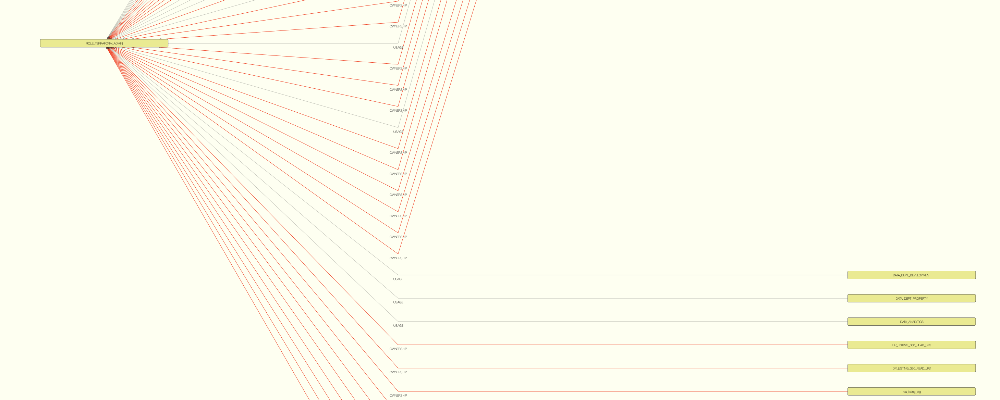

# SnowflakeGuiHacks
UI Prototypes for snowflake related concepts

Forked from

## Wiki
- [Visualizing Snowflake Roles and Grants](https://github.com/venkatra/SnowflakeGuiHacks/wiki/Visualizing-Snowflake-Roles-and-Grants)

## Set up
1. Snowflake query to find your RBAC data
    - Query all grants to a certain grantee role, and convert into json format
        ```
        select 
        array_agg(OBJECT_CONSTRUCT(*))
        from snowflake.account_usage.grants_to_roles
        where 
        deleted_on is null
        and
        GRANTEE_NAME = 'ROLE_TERRAFORM_ADMIN'
        order by privilege
        ;
        ```
2. Save the json data to a file under `./data/grants_to_roles.json`
3. Run `npm install` to set up environment
4. Run `node index.js`
5. See your RBAC graph at `http://localhost:8080/roles.html`

## Modify the code
Modify `./roles.html` to modify the graph style, grants to include/exclude, node dependency etc.

## Example graph
